<div align="center">

# UVFD Hair Segmentation Benchmark

**Three segmentation architectures. One leakage-safe split. One metric harness.**

3-class semantic segmentation of skin-artifact hairs in UV-fluorescence dermatoscopy images,
benchmarking **DeepLabV3-ResNet50**, **SegFormer-B0** and **YOLO26-sem** under an identical
data pipeline, split and evaluation protocol.

<p>


</p>

</div>

---

## Headline result

All three models trained for **80 epochs** on the same leakage-safe split, evaluated once on the
same held-out test set (395 images) with the same confusion-matrix harness.

| Model | **fg mIoU** | mIoU | IoU dark | IoU light | mean Dice | pixel acc | params | train time |
|---|--:|--:|--:|--:|--:|--:|--:|--:|
| DeepLabV3-ResNet50 | 0.3276 | 0.5420 | 0.5487 | 0.1065 | 0.6287 | 0.9713 | 42.0 M | 276 min |
| SegFormer-B0 | 0.3496 | 0.5572 | **0.5636** | 0.1357 | 0.6486 | 0.9726 | 3.7 M | **65 min** |
| **YOLO26-sem** | **0.3554** | **0.5628** | 0.5515 | **0.1593** | **0.6581** | **0.9781** | **1.63 M** | 130 min |

**foreground mIoU** = mean IoU over the two hair classes. Background is 96% of all pixels, so
overall mIoU and pixel accuracy are flattered by the trivial class.

> YOLO26-sem scores highest on foreground mIoU with **26× fewer parameters than DeepLabV3**, which
> is last on every accuracy column. Its margin over SegFormer-B0 is only 0.006 on a single seed, so
> treat the top two as tied; the 0.028 gap down to DeepLabV3 is the firmer result.

<div align="center">
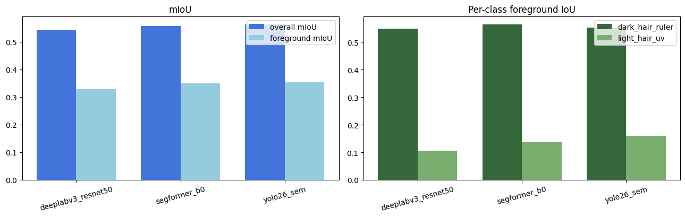
</div>

---

## Overview

Under UV fluorescence, skin hairs appear as two visually distinct artifact families that a
hair-removal / restoration pipeline must localise before it can inpaint them. This project treats
that as a **3-class semantic segmentation** problem at native 512×512 resolution and benchmarks a
CNN, a transformer and a real-time detector-derived segmenter on exactly the same data.

| ID | Class | Source mask folder | Overlay colour | Contents |
|:--:|---|---|:--:|---|
| `0` | `background` | n/a | none | skin, everything unlabelled |
| `1` | `dark_hair_ruler` | `black_masks/` | red `(255, 0, 0)` | dark hairs + ruler marks |
| `2` | `light_hair_uv` | `white_masks/` | green `(0, 255, 0)` | light hairs + UV-reflecting particles |

<div align="center">
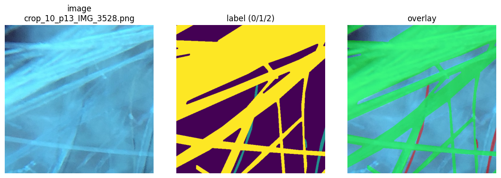
<br><sub>The first crop carrying both mask types. It is far denser than a typical tile — most crops
hold only a few thin strokes, per the distribution below.</sub>
</div>

Two properties drive the design decisions below:

- **Extreme class imbalance.** Background dominates at **96.20% / 2.60% / 1.19%** of pixels.
  Handled with inverse-frequency-weighted cross-entropy plus a Dice term that excludes background.
- **Thin structures.** Hairs are often 1–3 px wide, so masks are never resized with interpolation
  and the headline metric ignores the trivially-easy background class.

<div align="center">
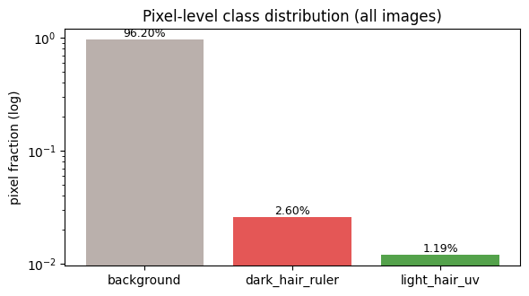
</div>

## Notebooks

Run them in order; every model notebook consumes the split produced by NB0.

| # | Notebook | Kaggle | Does | Writes |
|:--:|---|:--:|---|---|
| 0 | [`cse438-nb0-eda-and-data-prep.ipynb`](cse438-nb0-eda-and-data-prep.ipynb) | [▶](https://www.kaggle.com/code/samirhossain2001/cse438-nb0-eda-and-data-prep) | Dataset audit, label construction, class distribution, leakage-safe grouped split, class weights, augmentation design + sanity grids | `split.json`, `class_weights.json`, `results.json` (empty seed) |
| 1 | [`cse438-nb1-seg-deeplabv3.ipynb`](cse438-nb1-seg-deeplabv3.ipynb) | [▶](https://www.kaggle.com/code/samirhossain2001/cse438-nb1-seg-deeplabv3) | DeepLabV3-ResNet50 (COCO-pretrained), 80 epochs, test metrics, error analysis | `deeplabv3_resnet50_best.pt`, `results.json` |
| 2 | [`cse438-nb2-seg-segformer-b0.ipynb`](cse438-nb2-seg-segformer-b0.ipynb) | [▶](https://www.kaggle.com/code/samirhossain2001/cse438-nb2-seg-segformer-b0) | SegFormer-B0 (MiT-B0 encoder + all-MLP head), identical recipe | `segformer_b0_best.pt`, `results.json` |
| 3 | [`cse438-nb3-seg-yolov26-semantic.ipynb`](cse438-nb3-seg-yolov26-semantic.ipynb) | [▶](https://www.kaggle.com/code/samirhossain2001/cse438-nb3-seg-yolov26-semantic) | YOLO26-sem via Ultralytics **and** the final 3-model comparison (Task H) | `yolo_ds/`, `yolo_runs/uvfd_sem/weights/best.pt`, `results.json` |

Every notebook opens with a single `CONFIG` dict holding all paths, hyperparameters and constants;
nothing downstream hard-codes a learning rate, batch size or path.

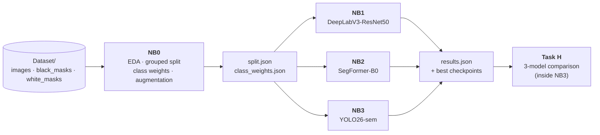

**Repo convention:** NB0 is committed with its EDA outputs; NB1–NB3 are committed cleared, with
their run figures in [`assets/`](assets). Executed copies (`*_op.ipynb`) stay local, excluded by
`.gitignore`; full run output is on the Kaggle links above.

## Dataset

[Mendeley UVFD dermatoscopy hair-removal dataset](https://data.mendeley.com/datasets/wvmw7p76t8/1),
mirrored on Kaggle as [`automatic-hair-removal`](https://www.kaggle.com/datasets/samirhossain2001/automatic-hair-removal).
UV-fluorescence photographs cropped to uniform 512×512 PNG tiles.

```
Dataset/
├── images/        2653 RGB crops (512×512 PNG)
├── black_masks/   2097 binary masks → class 1
└── white_masks/    850 binary masks → class 2   (849 usable; 1 orphan mask is dropped)
```

Verified on disk: all 2653 images are exactly 512×512, none are corrupt, **293** images carry both
masks, and **0** images carry neither — so the image folder is exactly the union of the two mask
sets. A missing mask therefore most likely means the artifact is absent from the crop rather than
unlabelled, so leaving those pixels as background is the right default.

<div align="center">
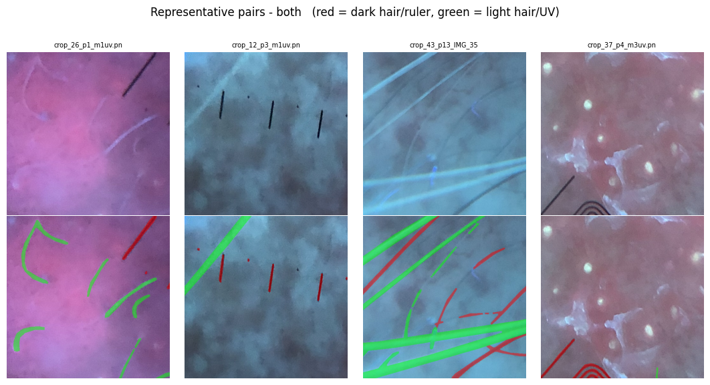
</div>

### Label construction

Masks are merged into one class-ID map per image (`build_label`, identical in all four notebooks):

```python
label = np.zeros((512, 512), np.uint8)
if fn in BLACK_MASKS: label[load_gray_mask(BLACK_DIR, fn) > 127] = 1
if fn in WHITE_MASKS: label[load_gray_mask(WHITE_DIR, fn) > 127] = 2   # light wins on overlap
```

- Masks are opened as `L`, resized **NEAREST** only, then thresholded at `> 127`.
- Where both masks fire, **class 2 overwrites class 1**. The masks overlap on 86,632 px across the
  293 images carrying both — 0.5% of all dark pixels and 1.0% of all light pixels.

### Data-root discovery

`find_data_root()` probes Kaggle mounts first, then the local path, then any
`/kaggle/input/**/black_masks` match, and accepts the first directory containing all three of
`images/`, `black_masks/` and `white_masks/`. Add your own path to its `candidates` list to run
elsewhere; it is the only place a path needs editing.

## Leakage-safe split

Crops taken from the same source photograph are near-duplicates. Splitting per-image would leak
them across train/val/test and inflate scores, so the **split unit is the source photograph**.

```python
group_key("crop_10_p23_field1.png")   # -> "p23_field1"   strips a leading or trailing crop index
```

Groups are shuffled with `random.Random(42)`, then assigned **largest group first** to whichever
split currently has the biggest shortfall against its image-count target. This tracks the requested
70/15/15 ratio closely without ever splitting a group.

| Split | Groups | Images | Share | has dark | has light | has both |
|---|--:|--:|--:|--:|--:|--:|
| train | 66 | 1859 | 70.1% | 1396 | 713 | 250 |
| val | 28 | 399 | 15.0% | 337 | 84 | 22 |
| test | 27 | 395 | 14.9% | 364 | 52 | 21 |
| **total** | **121** | **2653** | 100% | **2097** | **849** | **293** |

Note the last two columns: **only 52 of 395 test images (13%) contain any `light_hair_uv` at all**,
and that class is just 0.43% of test pixels. Read the light-hair IoU column as a noisy estimate.

The notebooks assert this: every image lands in exactly one split, and every group maps
to exactly one split. Model notebooks re-assert pairwise disjointness after loading `split.json`.

### Class weights

Computed from the **train split only**, so no test-set statistic ever reaches the loss:

| class | train pixel fraction | `inverse_freq` weight | `median_freq` weight |
|---|--:|--:|--:|
| `background` | 0.96109 | 0.029 | 0.025 |
| `dark_hair_ruler` | 0.02359 | 1.170 | 1.000 |
| `light_hair_uv` | 0.01532 | 1.801 | 1.540 |

`inverse_freq` is used (`CONFIG["WEIGHT_TYPE"]`), normalised so the three weights average to 1.

## Augmentation

Applied to the **training split only**, with image and mask transformed together through
Albumentations' synchronized `image=` / `mask=` interface.

| Transform | p | Touches mask |
|---|:--:|:--:|
| `HorizontalFlip` | 0.5 | yes |
| `VerticalFlip` | 0.5 | yes |
| `RandomRotate90` | 0.5 | yes |
| `Affine`: scale 0.9–1.1, translate ≤5%, rotate ±20° | 0.3 | yes |
| `RandomBrightnessContrast(0.2, 0.2)` | 0.3 | image only |
| `OneOf[CLAHE(2.0), RandomGamma(80–120)]` | 0.2 | image only |
| `ElasticTransform(alpha=1.0, sigma=50.0)` | 0.15 | yes |
| `Normalize(ImageNet stats)` + `ToTensorV2` | always | image only |

<div align="center">
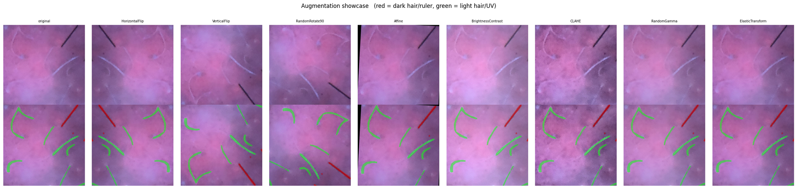
</div>

Validation and test use `Normalize + ToTensorV2` and nothing else, so evaluation stays
deterministic. The test set is touched exactly once, for the final metrics.

## Models

| Model | Backbone / checkpoint | Params | Head surgery |
|---|---|--:|---|
| DeepLabV3 | `deeplabv3_resnet50`, COCO-pretrained (`weights=DEFAULT`) | 42.0 M | `classifier[4]` and `aux_classifier[4]` replaced with `Conv2d(256, 3, 1)` |
| SegFormer-B0 | `nvidia/segformer-b0-finetuned-ade-512-512` | 3.7 M | `num_labels=3, ignore_mismatched_sizes=True`; logits upsampled 128→512 bilinear |
| YOLO26-sem | `yolo26n-sem.pt` (Ultralytics) | 1.63 M | `nc` overridden 19→3; 360/364 pretrained tensors transferred; 4.4 GFLOPs |

SegFormer is wrapped so its forward returns torchvision's `{"out": logits}` dict, which lets the
dataset, loss, training loop and evaluator be reused unchanged across NB1 and NB2.

YOLO26-sem needs a different data layout, so NB3 materialises the same split as
`yolo_ds/images/{train,val,test}` plus a parallel `yolo_ds/masks/...` of class-ID PNGs and a
generated `data.yaml`. Its predictions are scored by the *same* confusion-matrix harness, so all
three sets of numbers stay comparable.

## Training recipe

Shared by NB1 and NB2:

- **Optimizer:** `AdamW`, `weight_decay=1e-4`, discriminative learning rates: pretrained backbone
  low, fresh head high (DeepLabV3 `1e-5` / `1e-4`; SegFormer `6e-5` / `1e-4`).
- **Schedule:** 5% linear warmup then cosine decay, stepped **per batch** over
  `80 × 232 = 18,560` steps.
- **Loss:** `ComboLoss = CE(weight=inverse_freq) + Dice(background excluded) [+ 0.4 × CE(aux head)]`.
- **Precision:** AMP via `torch.amp.autocast` + `GradScaler`. No gradient accumulation.
- **Duration:** the full 80 epochs, no early stopping. The run prints a warning if the best epoch
  is the last one, i.e. validation was still improving.
- **Checkpointing:** saved whenever **validation foreground mIoU** improves, to
  `<model_name>_best.pt`. Background is excluded from the selection metric so a model cannot win by
  predicting skin everywhere.

<details>
<summary><b>NB1: DeepLabV3 CONFIG</b></summary>

```python
"MODEL_NAME":      "deeplabv3_resnet50",
"SEED": 42, "IMG_SIZE": 512, "NUM_CLASSES": 3,
"BATCH_SIZE":      8,
"EPOCHS":          80,
"LR_BACKBONE":     1e-5,
"LR_HEAD":         1e-4,
"WEIGHT_DECAY":    1e-4,
"WARMUP_FRAC":     0.05,
"AUX_WEIGHT":      0.4,
"NUM_WORKERS":     2,
"USE_AMP":         True,
"WEIGHT_TYPE":     "inverse_freq",   # or "median_freq"
"DICE_INCLUDE_BG": False,
```
</details>

<details>
<summary><b>NB2: SegFormer-B0 CONFIG</b> (deltas only)</summary>

```python
"MODEL_NAME":  "segformer_b0",
"CHECKPOINT":  "nvidia/segformer-b0-finetuned-ade-512-512",
"LR_BACKBONE": 6e-5,   # MiT-B0 encoder
"LR_HEAD":     1e-4,   # all-MLP decode head
"AUX_WEIGHT":  0.4,    # inert: SegFormer has no aux head, kept for a shared config schema
```
</details>

<details>
<summary><b>NB3: YOLO26-sem CONFIG</b></summary>

```python
"MODEL_NAME": "yolo26_sem",
"CHECKPOINT": "yolo26n-sem.pt",
"EPOCHS": 80, "BATCH_SIZE": 8, "IMG_SIZE": 512, "SEED": 42,
"YOLO_TRAIN": {
    "optimizer": "AdamW", "cos_lr": True, "warmup_epochs": 3,
    "fliplr": 0.5, "flipud": 0.5, "degrees": 20.0,
    "scale": 0.1, "translate": 0.05,
    "hsv_h": 0.015, "hsv_s": 0.3, "hsv_v": 0.3,
    "mosaic": 0.0, "mixup": 0.0, "copy_paste": 0.0,
},
```

Everything not listed stays at the Ultralytics default — notably `lr0=0.01`,
`weight_decay=0.0005`, `patience=100` and its own `ce + dice + aux` loss, which is why this
arm is not a perfectly controlled comparison (see [Limitations](#limitations)).
</details>

### Training curves

| DeepLabV3-ResNet50 | SegFormer-B0 |
|---|---|
| 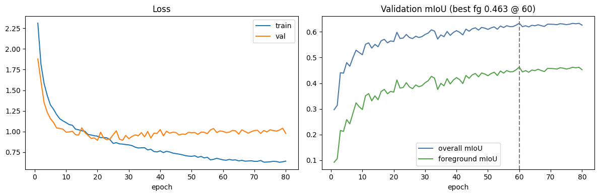 | 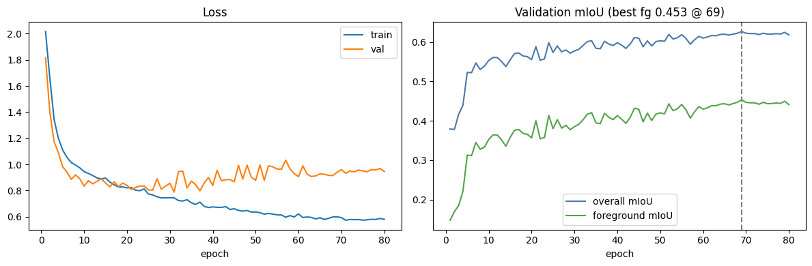 |
| best val fg mIoU **0.4630** @ epoch 60 | best val fg mIoU **0.4533** @ epoch 69 |

<div align="center">
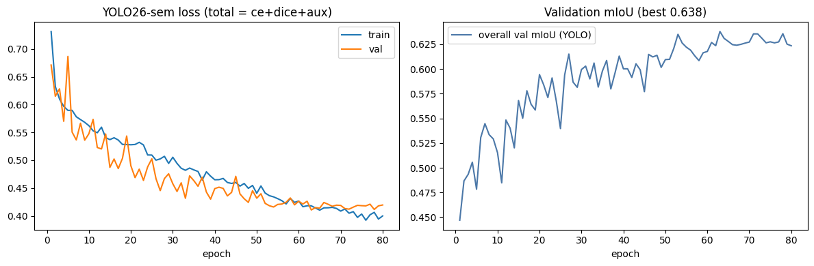
<br><sub>YOLO26-sem — best overall val mIoU <b>0.638</b> (Ultralytics reports overall, not foreground, mIoU)</sub>
</div>

DeepLabV3 and SegFormer both peak late (epochs 60 and 69 of 80) and then plateau: validation loss
drifts up slightly while foreground mIoU stays flat.

## Metrics

All three models are scored by one `ConfusionMatrix` class (rows = ground truth, columns =
prediction), accumulated over the whole test set:

| Metric | Definition |
|---|---|
| per-class IoU | `TP / (TP + FP + FN)` |
| per-class Dice | `2·TP / (2·TP + FP + FN)` |
| mIoU | mean IoU over all 3 classes |
| **foreground mIoU** | mean IoU over classes 1 and 2 (**the headline metric**) |
| mean Dice (F1) | mean of per-class Dice |
| pixel accuracy | correct pixels / total pixels |
| mean pixel accuracy | mean per-class recall |

## Results

### Per-class breakdown

| Model | IoU bg | IoU dark | IoU light | Dice bg | Dice dark | Dice light | mean pixel acc | best epoch |
|---|--:|--:|--:|--:|--:|--:|--:|--:|
| DeepLabV3-ResNet50 | 0.9708 | 0.5487 | 0.1065 | 0.9852 | 0.7086 | 0.1925 | 0.6856 | 60 / 80 |
| SegFormer-B0 | 0.9722 | **0.5636** | 0.1357 | 0.9859 | **0.7209** | 0.2389 | **0.7184** | 69 / 80 |
| YOLO26-sem | **0.9777** | 0.5515 | **0.1593** | **0.9887** | 0.7109 | **0.2748** | 0.6498 | Ultralytics |

`light_hair_uv` is the hardest class for every model, scoring 3–5× below `dark_hair_ruler`. It is
the thinnest, the rarest (1.19% of pixels, present in 13% of test images) and the lowest-contrast
against UV-fluorescing skin.

### Accuracy vs cost

<div align="center">
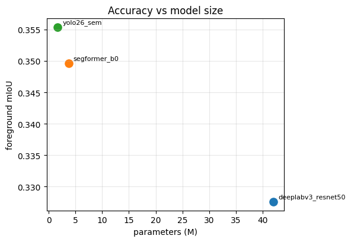
</div>

Across these three points foreground mIoU falls as parameter count rises — DeepLabV3's 42 M
parameters buy nothing here. With ~2.6k training crops that is consistent with the large backbone
being oversized for the task, though nothing in this setup separates capacity from its low
backbone learning rate.

### Confusion matrices (row-normalised)

| DeepLabV3-ResNet50 | SegFormer-B0 | YOLO26-sem |
|---|---|---|
| 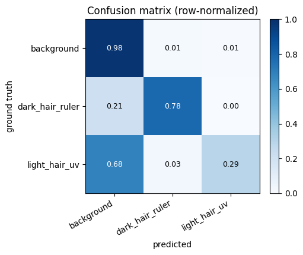 | 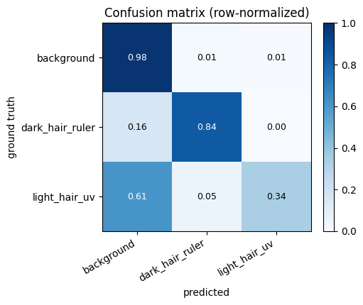 | 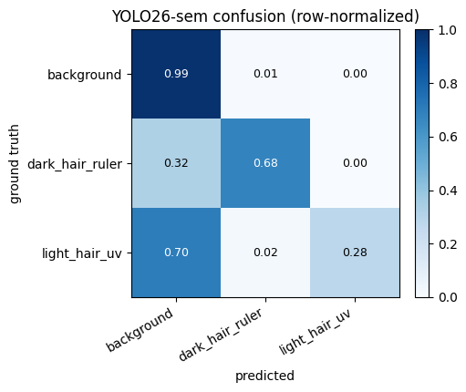 |
| most confused: `background` → `dark` (1.20% of px) | most confused: `background` → `dark` (1.36% of px) | most confused: `dark` → `background` (0.91% of px) |

Read the `dark_hair_ruler` row: **0.78 / 0.84 / 0.68** recall. SegFormer recovers the most true
hair pixels, YOLO26-sem the fewest — it misses 32% of them, against SegFormer's 16%. Yet YOLO still
lands at a comparable dark IoU (0.5515 vs 0.5636), which means the hair it does mark is cleaner:
fewer false positives on background. That also gives it the highest background recall (0.99) and
pixel accuracy (0.9781), and the lowest mean pixel accuracy (0.650), since mean pixel accuracy is
just the average of this diagonal.

So YOLO26-sem is the conservative one and SegFormer the liberal one, with DeepLabV3 in between and
behind SegFormer on both foreground rows. Which failure is preferable depends on the downstream use:
false positives smear healthy skin, false negatives leave hairs behind.

### Qualitative comparison

<div align="center">
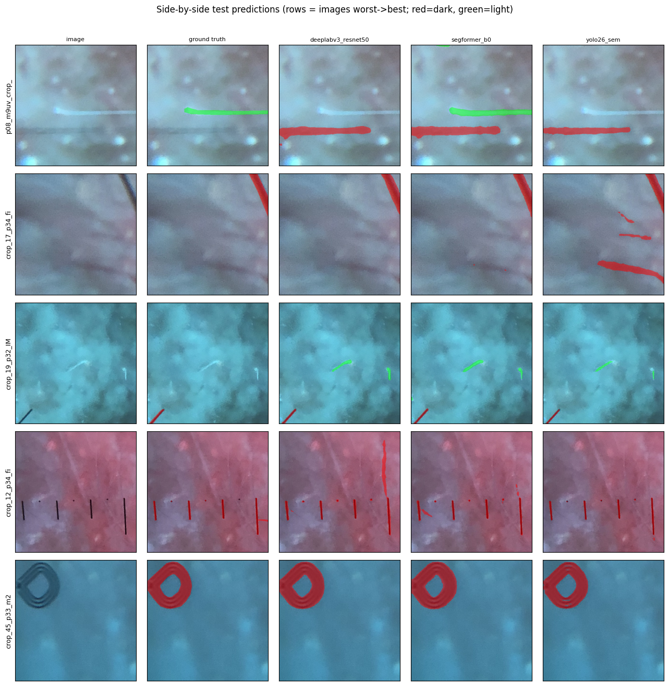
</div>

Rows span the per-image IoU range, worst at the top to best at the bottom. Row 1 is a class
assignment error rather than a localisation one: a pale hair labelled *light* that all three models
call *dark*. Row 5 (a ruler ring) is easy for all three. The middle rows are where they diverge,
each adding strokes the others do not.

### Cross-model agreement

<div align="center">
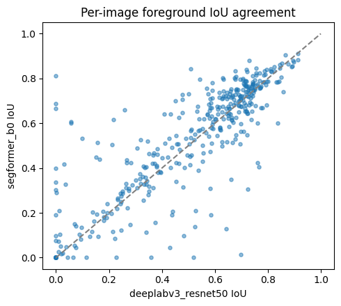
</div>

Mean **per-image** foreground IoU (unweighted across images, unlike the pixel-pooled table above):

| | DeepLabV3 | SegFormer-B0 | YOLO26-sem |
|---|--:|--:|--:|
| mean per-image fg IoU | 0.5141 | **0.5347** | 0.5181 |
| corr. with DeepLabV3 | 1.00 | 0.82 | 0.76 |
| corr. with SegFormer-B0 | 0.82 | 1.00 | 0.74 |
| corr. with YOLO26-sem | 0.76 | 0.74 | 1.00 |

SegFormer leads on the per-image average while YOLO26-sem leads on the pixel-pooled total, which
points to YOLO doing better on the hair-dense crops that dominate the pixel count. The 0.74–0.82
correlations indicate the three models tend to fail on the same images.

The 5 hardest images for **all three** models: `p08_m9uv_crop_017`, `crop_29_p11_field6`,
`p08_m9uv_crop_025`, `p08_m9uv_crop_020`, `crop_14_p11_field7` — three light-only crops and two
dark-only ones, all low-contrast against fluorescing skin.

### `results.json`

Every notebook merges its own entry into a shared `results.json`, the single source of truth for
the Task H comparison:

```jsonc
{
  "models": {
    "yolo26_sem": {
      "mIoU": 0.5628, "foreground_mIoU": 0.3554, "mDice": 0.6581,
      "pixel_acc": 0.9781, "mean_pixel_acc": 0.6498,
      "per_class_iou":  { "background": 0.9777, "dark_hair_ruler": 0.5515, "light_hair_uv": 0.1593 },
      "per_class_dice": { "background": 0.9887, "dark_hair_ruler": 0.7109, "light_hair_uv": 0.2748 },
      "params_M": 1.63, "epochs_run": 80, "train_minutes": 130.0
    }
  }
}
```

NB1 and NB2 additionally record `selection_metric`, `best_epoch` and the full `config` block.
Results accumulate across runs, so NB3 compares whatever is present.

### Error analysis inside each notebook

Each model notebook ends with per-image foreground IoU, the **worst 5 predictions** rendered as
`image | truth | prediction`, a spread across the IoU range (worst / p25 / median / p75 / best),
a row-normalised confusion matrix, and the most-confused class pair with its pixel share.

Task H in NB3 adds the grouped bar charts, radar chart, accuracy-vs-parameter scatter, per-image
IoU correlation and the cross-model hardest images reproduced above.

## Quick start

### Kaggle (intended environment)

GPU **T4** with **Internet enabled**, since pretrained weights are downloaded at runtime.
Reference runs: Python 3.12.13, torch 2.10.0+cu128, torchvision 0.25.0+cu128,
albumentations 2.0.8, ultralytics 8.4.93, Tesla T4.

1. Attach the [UVFD dataset](https://www.kaggle.com/datasets/samirhossain2001/automatic-hair-removal)
   so a folder containing `images/`, `black_masks/` and `white_masks/` is visible under `/kaggle/input/`.
2. Run **NB0** end to end. It writes `split.json`, `class_weights.json` and an empty `results.json`
   to `/kaggle/working/`.
3. Save `/kaggle/working/` as a Kaggle dataset (or use the NB0 notebook output directly). This is
   the shared-artifact bundle.
4. Attach *both* the UVFD dataset and that artifact bundle to **NB1**, **NB2** and **NB3**, then run
   them. Each appends its metrics and saves its best checkpoint.
5. For **Task H** in NB3, also attach NB1's and NB2's outputs (`results.json` + the `*_best.pt`
   checkpoints) so the comparison can load all three models and render side-by-side predictions.

Budget roughly **8 GPU-hours** for the full sweep (276 + 65 + 130 min). Each notebook fits inside
one Kaggle session; the three together do not.

### Local

```bash
git clone https://github.com/<your-username>/CSE438_Assignment.git
cd CSE438_Assignment

pip install torch torchvision albumentations transformers ultralytics \
            numpy pandas matplotlib pillow pyyaml tqdm jupyter

# place the dataset as:
#   Dataset/images/  Dataset/black_masks/  Dataset/white_masks/
jupyter lab cse438-nb0-eda-and-data-prep.ipynb
```

Locally, keep `split.json`, `class_weights.json`, `results.json` and the `*_best.pt` checkpoints in
the notebook's working directory, because `find_artifact()` searches there and under `/kaggle/...` only.

## Reproducibility

- Seed **42** for `random`, `numpy` and `torch` (CPU + CUDA), with `cudnn.deterministic=True` and
  `cudnn.benchmark=False`, re-applied before every stochastic step. YOLO is trained with
  `seed=42, deterministic=True`.
- DataLoaders use a seeded generator and a `seed_worker` init function, so worker-level augmentation
  order is reproducible.
- The split is computed once in NB0 and every model notebook loads it verbatim from `split.json`.
  It is never recomputed against a possibly different file listing. (If `split.json` is missing, the
  notebook warns and regenerates the identical seed-42 split.)
- Class weights come from the train split only.
- Evaluation transforms are deterministic; augmentation never touches validation or test.
- The test set is evaluated once, at the very end, after checkpoint selection on validation.

## Limitations

- **Single seed.** Each model is trained once, so there are no mean ± std bands. SegFormer-B0 and
  YOLO26-sem are separated by 0.006 foreground mIoU; treat their ranking as provisional and the
  `light_hair_uv` column (52 test images) as especially noisy.
- **Pixel IoU is harsh on thin structures.** A 1-px lateral shift on a 2-px hair can halve IoU.
  Skeleton-aware measures (clDice, boundary-F1) would be fairer and are not implemented.
- **YOLO26-sem is not a perfectly controlled comparison.** Its loss, learning rate, weight decay,
  class weighting and checkpoint-selection rule come from Ultralytics rather than this repo's
  `ComboLoss` and foreground-mIoU rule. Augmentation is aligned as closely as the API allows and the
  *evaluation* harness is identical, but the training side is not matched, so its win is not a
  like-for-like architecture verdict.
- **Ranking metrics disagree.** YOLO26-sem wins pixel-pooled foreground mIoU; SegFormer-B0 wins
  mean per-image foreground IoU. Neither is wrong — they weight hair-dense crops differently.
- **No version pins.** The setup cells print library versions rather than pin them, so a fresh
  environment may differ from the one a run was made in. If `A.Affine` rejects `mode=0`, your
  Albumentations is newer than the API used here; that argument is now `border_mode`.

## Acknowledgements

- **Dataset:** UVFD dermatoscopy hair-removal dataset, Mendeley Data
  ([`wvmw7p76t8`](https://data.mendeley.com/datasets/wvmw7p76t8/1)). Cite and reuse under the terms
  given on the Mendeley record.
- **DeepLabV3-ResNet50:** torchvision, COCO-pretrained weights.
- **SegFormer-B0:** NVIDIA, `nvidia/segformer-b0-finetuned-ade-512-512` via Hugging Face Transformers.
- **YOLO26-sem:** Ultralytics.

## License

The code in this repository is released under the [MIT License](LICENSE).

It covers the notebooks and the figures in `assets/`. Dependencies keep their own terms:

| Component | Terms |
|---|---|
| UVFD dataset (Mendeley `wvmw7p76t8`) | as stated on the [Mendeley record](https://data.mendeley.com/datasets/wvmw7p76t8/1) — not redistributed here |
| torchvision + COCO-pretrained DeepLabV3 weights | BSD-3-Clause |
| `nvidia/segformer-b0-finetuned-ade-512-512` | NVIDIA Source Code License (non-commercial) |
| Ultralytics + `yolo26n-sem.pt` | AGPL-3.0, or an Ultralytics Enterprise License |

The last two bind anything built on this: the SegFormer checkpoint is non-commercial, and
Ultralytics' AGPL-3.0 is copyleft that reaches network services.
